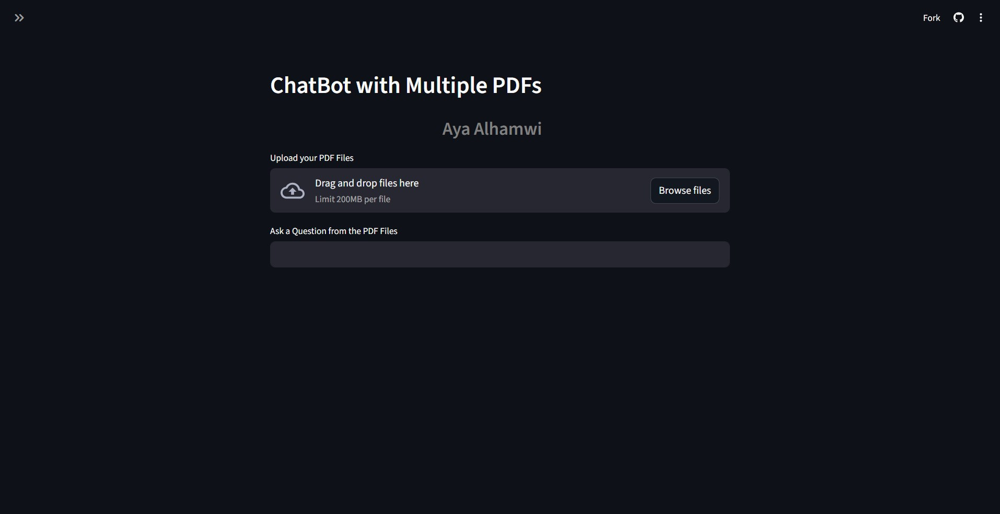

# Chatbot with Multiple PDFs 📚🤖

A chatbot that allows you to **upload multiple PDF files** and interact with them by asking questions.  
The system is built using **RAG (Retrieval-Augmented Generation)** with **LangChain**, **FAISS** as the vector database, and a simple **Streamlit** interface.

---

## ✨ Features

- Upload and process multiple PDF files at once.
- Extract text from PDFs and split it into manageable chunks.
- Generate **embeddings** using HuggingFace MiniLM (`sentence-transformers/all-MiniLM-L6-v2`).
- Store embeddings in a **FAISS** vector database for efficient retrieval.
- Perform **similarity search** to fetch the most relevant text chunks for a given query.
- Use **Google Gemini** (via `langchain_google_genai`) to generate accurate answers based only on the retrieved context.
- User-friendly interface built with **Streamlit**.
- Download full conversation history as a **CSV file**.

---

## 🔗 Live Demo

You can try the live version of the chatbot here:  
[https://chatbot-multiple-pdfs-ayaalhamwi.streamlit.app/](https://chatbot-multiple-pdfs-ayaalhamwi.streamlit.app/)

---

## Demo Screenshot

  
*Example of how the chat interface looks*

---

## Installation 💻

1. Clone the repository:

```bash
git clone https://github.com/YourUsername/ChatBot-with-Multiple-PDFs.git
cd ChatBot-with-Multiple-PDFs
```
## Create a virtual environment and activate it:

```bash
python -m venv venv
# Windows
venv\Scripts\activate
# macOS/Linux
source venv/bin/activate

```

## Install dependencies:
```bash
pip install -r requirements.txt

```
Add your Google API Key:

Create a .env file in the root directory:

```bash
# .env
GOOGLE_API_KEY= # Add your Google API Key here
```

Run the app:
```bash
streamlit run app.py
```

## Deployment ☁️

After setting up the project locally, you can **deploy it online** using **Streamlit Community Cloud**:

1. Push your code to a **GitHub repository**.
2. Go to [Streamlit Cloud](https://share.streamlit.io/) and click **"New app"**.
3. Select your **GitHub repository**, choose the branch (`main` or `master`) and the main file path (`app.py`).
4. Add your **Google API Key** as a secret in Streamlit Cloud.
5. Click **"Deploy"** to launch your chatbot online.


---

## Project Structure 🗂️
```bash
pdf-chatbot/
│
├─ app.py                # Main Streamlit app
├─ requirements.txt      # Required Python packages
├─ runtime.txt           # Python version for Streamlit Cloud
├─ README.md             # Project documentation
├─ .gitignore            # Files to ignore (venv, .env, etc.)
├─ utils/                # Helper modules
│   ├─ __init__.py
│   ├─ pdf_utils.py
│   ├─ vector_utils.py
│   └─ qa_utils.py
└─ .env                  # Your private Google API Key (do not push!)
```

## Usage 📝
-Open the app in your browser.

-Upload one or more PDFs.

-Ask a question in the input field (e.g., "What is the summary of chapter 1?").

-Get AI-generated answers based on your PDF content.

-Download the conversation history if needed.

## Notes ⚠️

-Keep your .env private, do not push the actual key to GitHub.

-The FAISS index (faiss_index/) is generated automatically and does not need to be pushed.

-The app uses Python 3.12.2, specified in runtime.txt.

